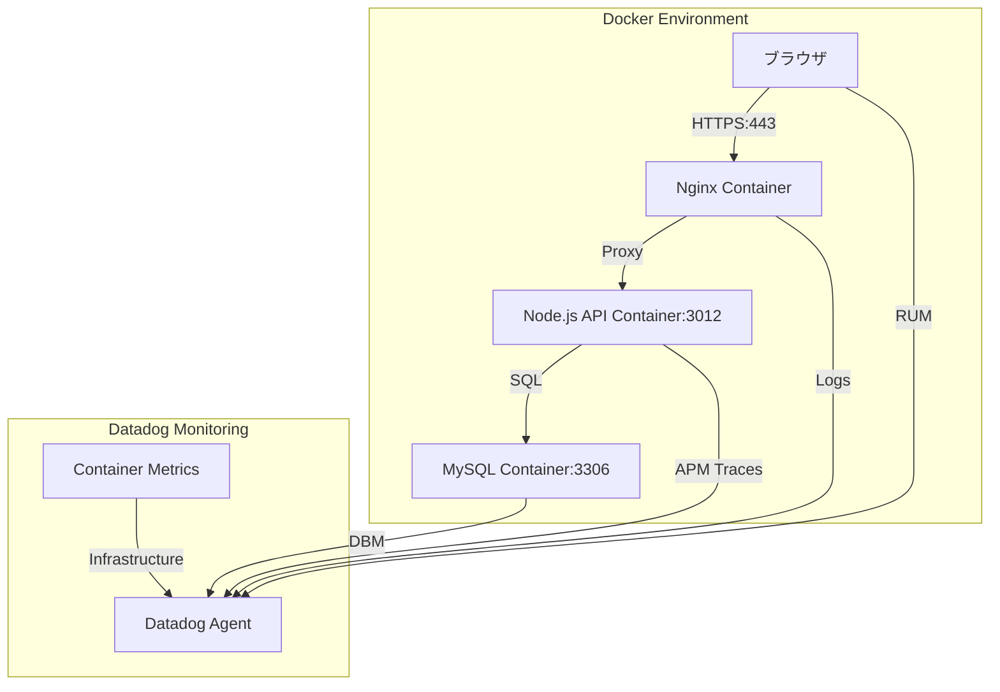
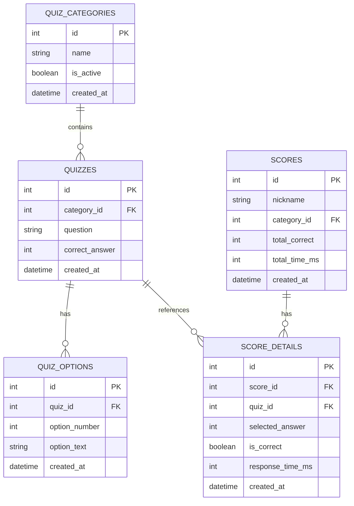
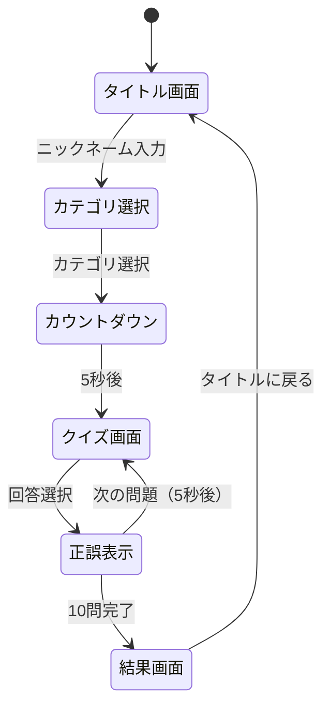

# フラッシュクイズ - 基本設計書

## 1. システムアーキテクチャ

### 1.1 全体構成



### 1.2 コンテナ構成

| コンテナ名 | ベースイメージ | ポート | 役割 |
|-----------|--------------|--------|------|
| Flash-quiz2-web | nginx:alpine | 443 | Webサーバー、リバースプロキシ |
| Flash-quiz2-api | node:18-alpine | 3012 | APIサーバー（Express） |
| Flash-quiz2-db | mysql:8.0 | 3306 | データベースサーバー |

### 1.3 技術スタック

**フロントエンド:**
- HTML5/CSS3/JavaScript（ES6+）
- p5.js（紙吹雪エフェクト）
- Datadog RUM

**バックエンド:**
- Node.js 18
- Express.js
- MySQL2（Node.js MySQL driver）
- dd-trace（Datadog APM）

**インフラ:**
- Docker & Docker Compose
- Nginx（リバースプロキシ、静的ファイル配信）
- MySQL 8.0

## 2. データベース設計

### 2.1 ER図



### 2.2 テーブル定義

#### QUIZ_CATEGORIES（クイズカテゴリ）
| カラム名 | 型 | NULL | キー | 説明 |
|---------|-----|------|------|------|
| id | INT | NO | PK | カテゴリID |
| name | VARCHAR(100) | NO | | カテゴリ名 |
| is_active | BOOLEAN | NO | | 選択可能フラグ |
| created_at | DATETIME | NO | | 作成日時 |

**データ例:**
- 昭和レトロの想い出（is_active=true）
- 令和トレンド（is_active=false）
- 海外トラベル（is_active=false）
- グルメ探訪（is_active=false）
- スポーツ雑学（is_active=false）

#### QUIZZES（クイズ設問）
| カラム名 | 型 | NULL | キー | 説明 |
|---------|-----|------|------|------|
| id | INT | NO | PK | クイズID |
| category_id | INT | NO | FK | カテゴリID |
| question | TEXT | NO | | 設問文 |
| correct_answer | INT | YES | | 正解番号（1-4）※5%はNULL |
| created_at | DATETIME | NO | | 作成日時 |

**障害トレーニング:** 5%のレコードで`correct_answer`がNULLになる

#### QUIZ_OPTIONS（回答選択肢）
| カラム名 | 型 | NULL | キー | 説明 |
|---------|-----|------|------|------|
| id | INT | NO | PK | 選択肢ID |
| quiz_id | INT | NO | FK | クイズID |
| option_number | INT | NO | | 選択肢番号（1-4） |
| option_text | VARCHAR(200) | NO | | 選択肢テキスト |
| created_at | DATETIME | NO | | 作成日時 |

#### SCORES（成績）
| カラム名 | 型 | NULL | キー | 説明 |
|---------|-----|------|------|------|
| id | INT | NO | PK | 成績ID |
| nickname | VARCHAR(50) | NO | | ニックネーム |
| category_id | INT | NO | FK | カテゴリID |
| total_correct | INT | NO | | 正解数 |
| total_time_ms | INT | NO | | 合計回答時間（ミリ秒） |
| created_at | DATETIME | NO | IDX | 作成日時 |

**障害トレーニング:** ニックネームが8文字未満の場合、APIでエラーを発生させる

#### SCORE_DETAILS（成績詳細）
| カラム名 | 型 | NULL | キー | 説明 |
|---------|-----|------|------|------|
| id | INT | NO | PK | 詳細ID |
| score_id | INT | NO | FK | 成績ID |
| quiz_id | INT | NO | FK | クイズID |
| selected_answer | INT | NO | | 選択した回答番号 |
| is_correct | BOOLEAN | NO | | 正誤フラグ |
| response_time_ms | INT | NO | | 回答時間（ミリ秒） |
| created_at | DATETIME | NO | | 作成日時 |

### 2.3 インデックス設計

```sql
-- QUIZZES
CREATE INDEX idx_category_id ON QUIZZES(category_id);

-- QUIZ_OPTIONS
CREATE INDEX idx_quiz_id ON QUIZ_OPTIONS(quiz_id);

-- SCORES
CREATE INDEX idx_created_at ON SCORES(created_at DESC);
CREATE INDEX idx_category_ranking ON SCORES(category_id, total_correct DESC, total_time_ms ASC);

-- SCORE_DETAILS
CREATE INDEX idx_score_id ON SCORE_DETAILS(score_id);
```

## 3. API設計

### 3.1 エンドポイント一覧

| メソッド | パス | 説明 | 認証 |
|---------|------|------|------|
| GET | /api/categories | カテゴリ一覧取得 | 不要 |
| GET | /api/quizzes/:categoryId | クイズ10問取得 | 不要 |
| POST | /api/scores | 成績登録 | 不要 |
| GET | /api/rankings/:categoryId | ランキング取得（Top10） | 不要 |
| GET | /api/health | ヘルスチェック | 不要 |

### 3.2 API詳細仕様

#### GET /api/categories
カテゴリ一覧を取得

**レスポンス例:**
```json
{
  "categories": [
    {
      "id": 1,
      "name": "昭和レトロの想い出",
      "isActive": true
    },
    {
      "id": 2,
      "name": "令和トレンド",
      "isActive": false
    }
  ]
}
```

#### GET /api/quizzes/:categoryId
指定カテゴリからランダムに10問取得

**パラメータ:**
- categoryId: カテゴリID

**レスポンス例:**
```json
{
  "quizzes": [
    {
      "id": 1,
      "question": "自宅前に置かれた黄色い木箱は何に使ってた？",
      "options": [
        { "number": 1, "text": "郵便受け" },
        { "number": 2, "text": "家庭ゴミの収集" },
        { "number": 3, "text": "牛乳配達" },
        { "number": 4, "text": "幸せの黄色いハンカチ入れ" }
      ]
    }
  ]
}
```

**障害トレーニング:** 5%の確率で2秒以上の遅延を発生させる

#### POST /api/scores
成績を登録

**リクエストボディ:**
```json
{
  "nickname": "レトロ太郎",
  "categoryId": 1,
  "answers": [
    {
      "quizId": 1,
      "selectedAnswer": 3,
      "responseTimeMs": 2500
    }
  ]
}
```

**バリデーション:**
- nickname: 必須、8文字以上50文字以下
- categoryId: 必須、存在するカテゴリID
- answers: 必須、配列（10問分）

**障害トレーニング:** nicknameが8文字未満の場合、400エラーを返す（エラーメッセージは「入力エラーが発生しました」のみ）

**レスポンス例:**
```json
{
  "scoreId": 123,
  "totalCorrect": 8,
  "totalTimeMs": 25000,
  "ranking": 2
}
```

**エラーレスポンス（正解データがNULLの場合）:**
```json
{
  "error": "クイズデータに不整合があります",
  "quizId": 5
}
```

#### GET /api/rankings/:categoryId
ランキングTop10を取得

**パラメータ:**
- categoryId: カテゴリID

**レスポンス例:**
```json
{
  "rankings": [
    {
      "rank": 1,
      "nickname": "昭和マスター",
      "totalCorrect": 10,
      "totalTimeMs": 18000,
      "createdAt": "2026-05-05T12:00:00Z"
    }
  ]
}
```

**ランキング順位決定ロジック:**
1. 正解数が多い順
2. 正解数が同じ場合は合計回答時間が短い順
3. それも同じ場合は登録日時が早い順

#### GET /api/health
ヘルスチェック（Datadog監視用）

**レスポンス例:**
```json
{
  "status": "ok",
  "timestamp": "2026-05-05T12:00:00Z",
  "database": "connected"
}
```

## 4. フロントエンド設計

### 4.1 画面遷移図



### 4.2 画面仕様

#### タイトル画面
**表示要素:**
- タイトル「フラッシュクイズ」（大きく表示）
- ニックネーム入力フィールド
- スタートボタン（ニックネーム入力で有効化）
- ランキング表示切替ボタン

**動作:**
- ニックネーム未入力時はスタートボタン無効
- ランキングボタンでTop10表示/非表示切替

#### カテゴリ選択画面
**表示要素:**
- 5つのカテゴリボタン
- 「昭和レトロの想い出」のみ選択可能
- 他は「準備中」表示

#### カウントダウン画面
**表示要素:**
- 5→4→3→2→1のカウントダウン
- アニメーション効果

#### クイズ画面
**表示要素:**
- 問題番号（1/10形式）
- 設問文
- 4つの選択肢ボタン
- タイマー表示（回答開始からの経過時間）

**動作:**
- 選択肢クリックで回答確定
- 回答時間を記録

#### 正誤表示画面
**表示要素:**
- 正解/不正解の表示（大きく）
- 正解の選択肢を表示
- 次の問題へのカウントダウン（5秒）

**動作:**
- 5秒後に自動で次の問題へ遷移

#### 結果画面
**表示要素:**
- 正解数（10問中X問正解）
- 合計回答時間
- ランキング順位
- Top3の場合は紙吹雪エフェクト（p5.js）
- 「タイトルに戻る」ボタン

**動作:**
- Top3の場合、p5.jsで紙吹雪アニメーション
- 効果音やお祝いメッセージ

### 4.3 デザインガイドライン

**カラースキーム:**
- プライマリ: #FF6B6B（レトロレッド）
- セカンダリ: #FFD93D（レトロイエロー）
- アクセント: #6BCB77（レトログリーン）
- 背景: #F8F9FA
- テキスト: #2C3E50

**フォント:**
- タイトル: 'Noto Sans JP', sans-serif（Bold）
- 本文: 'Noto Sans JP', sans-serif（Regular）

**レスポンシブ:**
- モバイルファースト設計
- ブレークポイント: 768px

## 5. Datadog監視設計

### 5.1 Infrastructure Monitoring
**監視対象:**
- コンテナメトリクス（CPU、メモリ、ネットワーク）
- ディスク使用率
- コンテナステータス

**アラート条件:**
- CPU使用率 > 80%（5分間継続）
- メモリ使用率 > 90%
- コンテナダウン

### 5.2 APM（Application Performance Monitoring）
**トレース対象:**
- 全APIエンドポイント
- データベースクエリ
- 外部サービス呼び出し

**計測メトリクス:**
- レスポンスタイム（p50, p95, p99）
- エラーレート
- スループット（req/sec）

**アラート条件:**
- エラーレート > 5%
- p95レスポンスタイム > 1秒

### 5.3 DBM（Database Monitoring）
**監視対象:**
- スロークエリ（> 1秒）
- クエリ実行回数
- コネクション数
- デッドロック

### 5.4 RUM（Real User Monitoring）
**計測項目:**
- ページロード時間
- JavaScriptエラー
- ユーザーセッション
- クリックイベント

**カスタムイベント:**
- クイズ開始
- 回答送信
- 結果表示

### 5.5 Logs
**ログ収集:**
- Nginxアクセスログ
- Nginxエラーログ
- Node.jsアプリケーションログ
- MySQLスロークエリログ

**ログレベル:**
- ERROR: エラー発生時
- WARN: 警告（遅延、リトライなど）
- INFO: 通常動作
- DEBUG: デバッグ情報

### 5.6 監視アラート
**NginxのURL監視:**
- エンドポイント: https://[your-domain]/api/health
- チェック間隔: 1分
- タイムアウト: 5秒
- アラート条件: 3回連続失敗

## 6. 障害トレーニング仕様

### 6.1 DBデータ不整合（5%）
**実装方法:**
- 初期データ投入時、100問中5問の`correct_answer`をNULLに設定
- ランダムに選択

**期待される動作:**
- APIで正誤判定時にエラーが発生
- エラーログに記録
- ユーザーにエラーメッセージ表示
- Datadog APMでエラートレースが記録される

### 6.2 API応答遅延（5%）
**実装方法:**
```javascript
// 5%の確率で2秒遅延
if (Math.random() < 0.05) {
  await new Promise(resolve => setTimeout(resolve, 2000));
}
```

**期待される動作:**
- レスポンスタイムが2秒以上になる
- タイムアウトエラーにはならない
- Datadog APMでスローリクエストとして記録される

### 6.3 ニックネームバリデーションエラー
**実装方法:**
```javascript
if (nickname.length < 8) {
  throw new Error('入力エラーが発生しました');
}
```

**期待される動作:**
- 8文字未満のニックネームで400エラー
- エラーメッセージは具体的な条件を示さない
- ユーザーは試行錯誤で8文字以上が必要と気づく
- Datadog RUMでエラーが記録される

## 7. デプロイメント設計

### 7.1 ディレクトリ構造
```
flash-quiz/
├── docker-compose.yml
├── .env.example
├── README.md
├── docs/
│   ├── 01要件定義.md
│   ├── 02基本設計.md
│   └── datadog-setup.md
├── nginx/
│   ├── Dockerfile
│   ├── nginx.conf
│   └── ssl/
│       ├── cert.pem
│       └── key.pem
├── frontend/
│   ├── index.html
│   ├── css/
│   │   └── style.css
│   ├── js/
│   │   ├── app.js
│   │   ├── quiz.js
│   │   └── confetti.js
│   └── assets/
│       └── images/
├── api/
│   ├── Dockerfile
│   ├── package.json
│   ├── package-lock.json
│   ├── src/
│   │   ├── index.js
│   │   ├── config/
│   │   │   ├── database.js
│   │   │   └── datadog.js
│   │   ├── routes/
│   │   │   ├── categories.js
│   │   │   ├── quizzes.js
│   │   │   ├── scores.js
│   │   │   └── rankings.js
│   │   ├── models/
│   │   │   ├── quiz.js
│   │   │   └── score.js
│   │   ├── middleware/
│   │   │   ├── errorHandler.js
│   │   │   └── slowdown.js
│   │   └── utils/
│   │       └── logger.js
│   └── .dockerignore
└── mysql/
    ├── Dockerfile
    ├── init/
    │   ├── 01-schema.sql
    │   ├── 02-categories.sql
    │   ├── 03-quizzes.sql
    │   └── 04-sample-scores.sql
    └── conf.d/
        └── my.cnf
```

### 7.2 環境変数設計
```env
# MySQL
MYSQL_ROOT_PASSWORD=your_root_password
MYSQL_DATABASE=flash_quiz
MYSQL_USER=quiz_user
MYSQL_PASSWORD=your_password

# Node.js API
NODE_ENV=production
API_PORT=3012
DB_HOST=mysql
DB_PORT=3306
DB_NAME=flash_quiz
DB_USER=quiz_user
DB_PASSWORD=your_password

# Datadog
DD_API_KEY=your_datadog_api_key
DD_SITE=datadoghq.com
DD_SERVICE=flash-quiz-api
DD_ENV=production
DD_VERSION=1.0.0
DD_LOGS_INJECTION=true
DD_TRACE_SAMPLE_RATE=1.0

# Datadog RUM
DD_RUM_APPLICATION_ID=your_rum_app_id
DD_RUM_CLIENT_TOKEN=your_rum_client_token
```

### 7.3 デプロイ手順
1. Ubuntuサーバーにログイン
2. Dockerとdocker-composeをインストール
3. GitHubからリポジトリをクローン
4. `.env`ファイルを作成し、環境変数を設定
5. SSL証明書を配置（Let's Encryptまたは自己署名）
6. `docker-compose up -d --build`でコンテナ起動
7. `docker-compose logs -f`でログ確認
8. ブラウザで動作確認

## 8. セキュリティ設計

### 8.1 通信セキュリティ
- HTTPS通信（TLS 1.2以上）
- HTTPSへの自動リダイレクト

### 8.2 データベースセキュリティ
- 最小権限の原則（アプリ用ユーザーは必要な権限のみ）
- パスワードは環境変数で管理
- 外部からの直接アクセス不可（Dockerネットワーク内のみ）

### 8.3 アプリケーションセキュリティ
- SQLインジェクション対策（プリペアドステートメント使用）
- XSS対策（入力値のサニタイズ）
- CORS設定（必要なオリジンのみ許可）
- レート制限（DDoS対策）

### 8.4 コンテナセキュリティ
- 非rootユーザーでの実行
- 最小限のベースイメージ使用（Alpine Linux）
- 定期的なイメージ更新

## 9. パフォーマンス設計

### 9.1 データベース最適化
- 適切なインデックス設定
- コネクションプーリング
- クエリキャッシュ

### 9.2 API最適化
- レスポンスのgzip圧縮
- 適切なHTTPキャッシュヘッダー
- 非同期処理の活用

### 9.3 フロントエンド最適化
- 静的ファイルのキャッシュ
- 画像の最適化
- JavaScriptの最小化

## 10. テスト設計

### 10.1 単体テスト
- APIエンドポイントのテスト
- データベースモデルのテスト
- ユーティリティ関数のテスト

### 10.2 統合テスト
- API→DB連携テスト
- エンドツーエンドのクイズフローテスト

### 10.3 障害テスト
- DBデータ不整合時の動作確認
- API遅延時の動作確認
- ニックネームエラー時の動作確認

### 10.4 負荷テスト
- 同時接続数テスト
- レスポンスタイム計測

## 11. 運用設計

### 11.1 バックアップ
- MySQLデータの日次バックアップ
- バックアップの世代管理（7日分保持）

### 11.2 ログローテーション
- Nginxログの日次ローテーション
- アプリケーションログの日次ローテーション

### 11.3 監視とアラート
- Datadog監視ダッシュボード作成
- アラート通知先設定（Slack、メールなど）

### 11.4 メンテナンス
- 定期的なDockerイメージ更新
- セキュリティパッチ適用
- データベースの最適化（OPTIMIZE TABLE）

---

以上が「フラッシュクイズ」アプリケーションの基本設計書です。